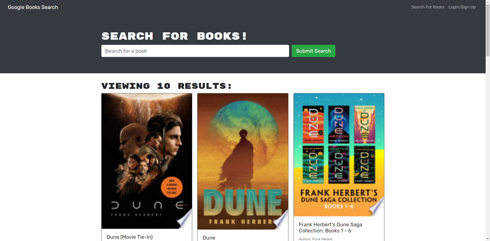
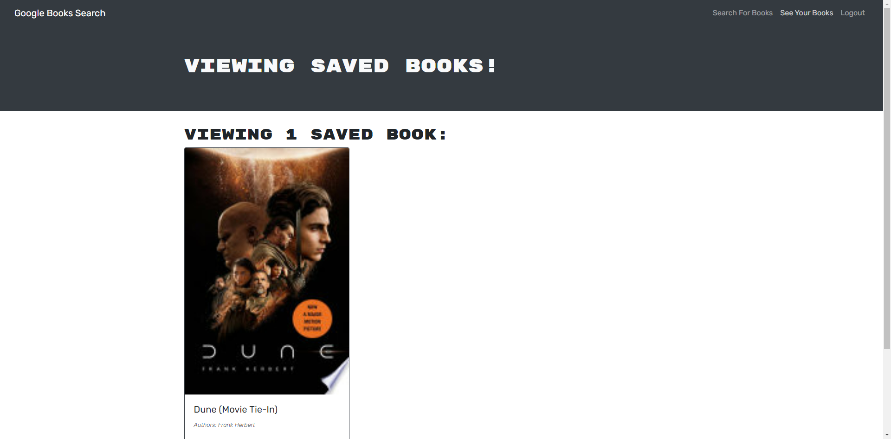
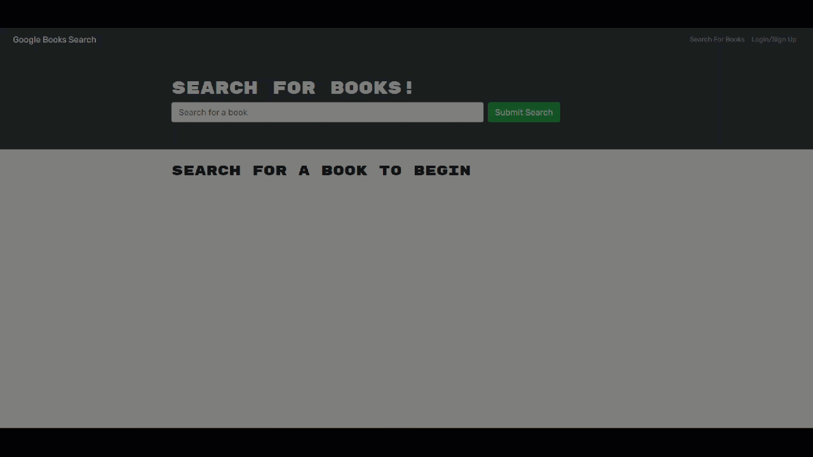

# MERN Google Book Search Engine 

## Brief Description 🔖 
   Book Search Engine allow you to search for and then save books.

## Table of Contents 📇
   * [Brief Description](#description)
   * [About MERN Google Book Search Engine](#about)
   * [Installation](#install)
   * [Usage](#usage)
   * [Testing](#test)
   * [Screenshots](#screenshots)
   * [Demo Video](#demo)
   * [Github Pages URL](#pages) 
   * [Github Repository URL](#repo)
   * [Heroku Deployment URL](#heroku)
   * [Contact Details](#contact)
   * [License](#license)
   * [Contributions to Repo](#contributions)
   * [Additional Information](#info)

## About MERN Google Book Search Engine 📖 
   Refactored a fully functioning Google Books API search engine built with a RESTful API into a GraphQL API built with Apollo Server & Express. The app was built using the MERN stack, with a React front end, MongoDB database, and Node.js/Express.js server and API.
   
## Installation 🏗️ 
   npm i
 
## Usage 📝 
   npm install -> npm run build -> npm run develop   
      
## Testing 
   npm test

## Screenshots 📷 
   
   
    
   
## Demo Video 📺 
    
   
        
## Github Pages URL 🔗 
   <a href="https://bkturner1220.github.io/MERN-Google_Book_Search" target="_blank">https://bkturner1220.github.io/MERN-Google_Book_Search</a>
   
## Github Repository URL 🔗 
   <a href="https://github.com/bkturner1220/MERN-Google_Book_Search" target="_blank">https://github.com/bkturner1220/MERN-Google_Book_Search</a>

## Heroku Deployment URL 🔗 
   <a href="https://git.heroku.com/peaceful-oasis-83182.git" target="_blank">https://git.heroku.com/peaceful-oasis-83182.git</a>
     
## Contact Information 
   Github Username: [bkturner1220](https://github.com/bkturner1220/) 
   Github: <a href="https://github.com/bkturner1220/">https://github.com/bkturner1220/</a> 
   Email: <a href="mailto:bturner@texascdlprep.com">bturner@texascdlprep.com</a>
   
## License Information 📛 
 
   The application is covered under MIT license.
   
## Contributions towards MERN Google Book Search Engine 👫 
   SMU Coding Bootcamp, Apollo Server documentation, and GraphQL documentation.
         
## Additional Information 
   If you encounter any problems, please feel free to reach out to me by sending me a [Email] to <a href="mailto:bturner@texascdlprep.com">bturner@texascdlprep.com</a>.
